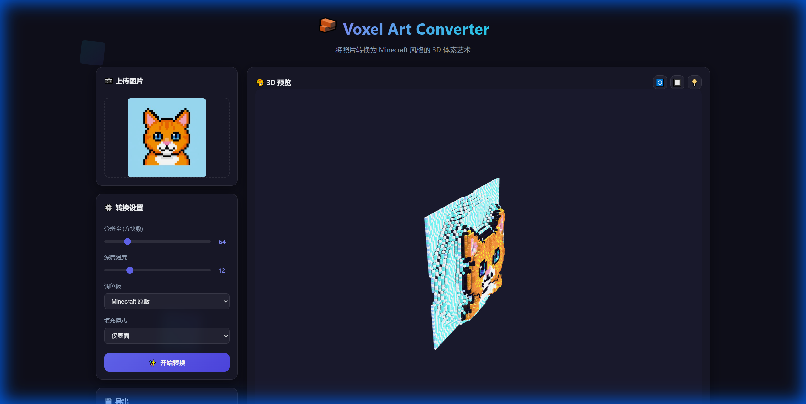

# 🧱 Voxel Art Converter

> [中文现有版本 (Chinese Version)](README_zh.md)

Convert any photo into **Minecraft-style 3D Voxel Art**. Supports exporting to `.obj` and `.schematic` formats for seamless integration with Minecraft and 3D software.



## ✨ Features

- 📷 **Drag & Drop Upload** - Supports PNG/JPG images
- 🎨 **Smart Color Mapping** - 5 Minecraft Palettes + Floyd-Steinberg Dithering
- 📊 **Advanced Depth Estimation** - AI-enhanced Computer Vision algorithms
- 🎮 **Real-time 3D Preview** - Interactive Three.js rendering
- 📦 **OBJ Export** - Compatible with Blender, Unity, etc.
- 🏗️ **Schematic Export** - Fully compatible with MCEdit/WorldEdit

## 🚀 Live Demo

👉 [Experience Online](https://voxel-art-converter-in-web.vercel.app/)

## 🛠️ Local Installation

```bash
# Clone repository
git clone https://github.com/eyeruddy9/Voxel-Art-Converter-in-Web.git
cd Voxel-Art-Converter-in-Web

# Start local server
npx http-server . -p 8080

# Open browser at http://localhost:8080
```

## 🎯 How to Use

1. **Upload Image** - Drag & drop or click to select
2. **Adjust Settings**
   - Resolution: 16-256 blocks
   - Depth Scale: 1-50 layers
   - Palette: Minecraft / Terracotta / Wool / Concrete
   - Fill Mode: Surface / Solid / Hollow
3. **Convert** - Click button to generate 3D model
4. **Export** - Download as OBJ or Schematic file

## 📁 Project Structure

```
├── index.html              # Main HTML
├── css/style.css           # Stylesheet
└── js/
    ├── app.js              # Application Logic
    ├── i18n.js             # Internationalization
    ├── imageProcessor.js   # Image Processing
    ├── depthEstimator.js   # Depth Estimation Algorithm
    ├── voxelizer.js        # Voxelization Core
    ├── voxelRenderer.js    # Three.js Renderer
    ├── minecraft/palette.js # Color Palettes
    └── exporters/
        ├── objExporter.js      # OBJ Exporter
        └── schematicExporter.js # Schematic Exporter
```

## 🔧 Tech Stack

- **Three.js** - WebGL 3D Rendering
- **Pako** - Gzip Compression (for Schematic)
- **Vanilla JS** - Zero Framework Dependency

## 🧠 Depth Estimation Algorithm

Analyzes image depth cues using Computer Vision techniques:

| Cue | Description |
|-----|-------------|
| **Luminance** | Brighter areas perceived as closer |
| **Saliency** | Focus areas detected as foreground |
| **Texture** | High texture complexity indicates foreground |
| **Gradient** | Vertical gradients suggest horizontal surfaces |
| **Color** | High contrast/saturation suggests foreground |
| **Position** | Bottom of image usually indicates foreground |

## 📄 License

GPLv2 License

## 🙏 Acknowledgements

- [Three.js](https://threejs.org/)
- [Minecraft](https://www.minecraft.net/)
